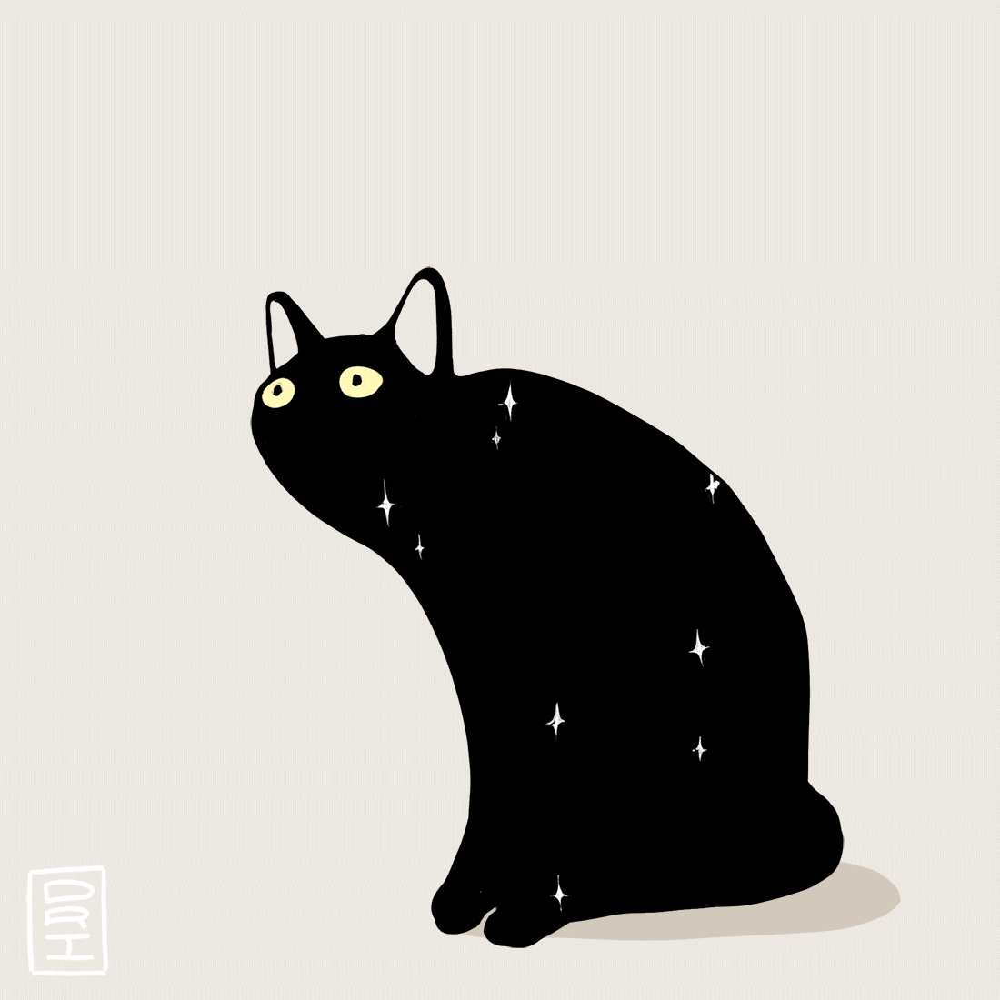

# 📌 Sherrylou Bas
## 🖳 Junior Web Developer | BS Computer Science Graduate

<table>
  <tr>
    <td valign="middle" width="20%" align="center">
        
    </td>
    <td valign="top">
      Hi! I'm a <strong>Junior Web Developer</strong> and a recent <strong>Computer Science graduate</strong> from the Philippines. My focus is on building clean, user-friendly web interfaces while strengthening the bridge between front-end aesthetics and back-end logic.
        
      I thrive on <strong>hands-on, project-based development</strong>. I prefer turning complex concepts into visual, working implementations that prioritize <strong>structured code and usability</strong>. 
        
      I am a disciplined, detail-oriented professional who excels in <strong>independent and remote environments</strong>. I'm constantly experimenting with new tools to build maintainable, user-focused web applications that solve real-world problems.  
    </td>
  </tr>
</table>

---

## 🌐 Socials:
  

---

## 🛠 Languages and Tools 

  
  
   
  
   
  

---

## 💽 GitHub Stats

<table><tbody><tr border="none"><td width="50%" align="center">

</td><td width="50%" align="center">
</td></tr></tbody></table>

